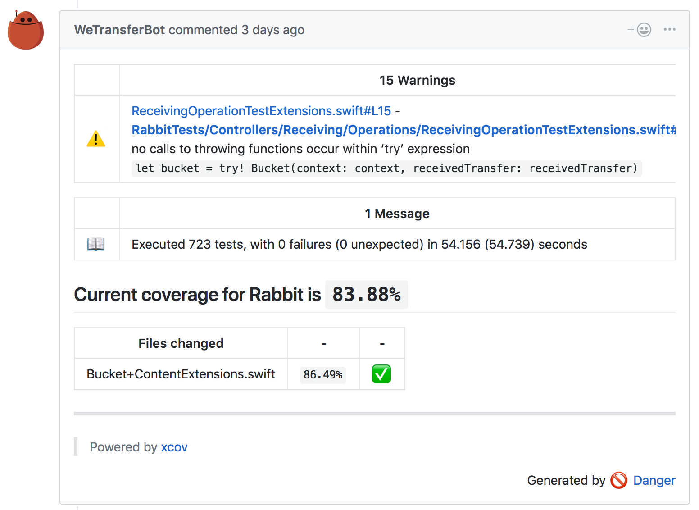

# WeTransfer-iOS-CI
[](https://travis-ci.org/WeTransfer/WeTransfer-iOS-CI)

Containing all the shared CI logic for WeTransfer repositories

# Why should I use it?
What's in it for me? Well, quite a lot! With low effort to add it to your project.

- Integrate [SwiftLint](https://github.com/realm/SwiftLint) to lint source code and tests. We have a different config for tests to allow `unwrapping optionals` for example
- Integrate [Danger](http://danger.systems/) to automatically improve PR reviews

## Danger features
Following are a list of features which are posted in a comment on PRs based on the submitted files.

  - Warn for big PRs, containing more than 500 lines of code
  - Warn for missing PR description
  - Warn for missing updated tests
  - Show code coverage of PR related files
  - Show any failed tests
  - Show all `warnings` and `errors` in the project

### Custom linting
These warnings are posted inline inside the PR, helping you to solve them easily.

  - Check for `final class` usage
  - `override` methods without adding logic
  -  Suggest `weak` over `unowned`
  -  Suggest `// MARK:` usage for large files

_A comment example. Note that `WeTransferBot` will be replaced by your own bot. More info can be found here: [Getting started with Danger](http://danger.systems/guides/getting_started.html)._



# How to integrate?

### 1: Add submodule
Add this repository as a submodule with the correct path `Submodules/WeTransfer-iOS-CI`:

```
[submodule "Submodules/WeTransfer-iOS-CI"]
	path = Submodules/WeTransfer-iOS-CI
	url = https://github.com/WeTransfer/WeTransfer-iOS-CI.git
```

### 2: Create a fastlane file

Create a fastlane file which executes testing with code coverage enabled. Import the Fastfile from this repo and trigger the `validate_changes` lane.

```ruby
import "./../Submodules/WeTransfer-iOS-CI/Fastlane/Fastfile"

desc "Clean the derived data, run tests validate the changes"
lane :test do |options|
  # clear_derived_data

  # Set timeout to prevent xcodebuild -list -project to take to much retries.
  ENV["FASTLANE_XCODE_LIST_TIMEOUT"] = "120"

  begin
    scan(
      scheme: options[:project_name],
      project: "#{options[:project_name]}.xcodeproj",
      device: "iPhone 7",
      clean: true,
      code_coverage: true,
      formatter: "xcpretty-json-formatter"
    )
  rescue => ex
    UI.error("Tests failed: #{ex}")
  end

  validate_changes(project_name: options[:project_name])
end
```

### 3: Integrate SwiftLint in your project
Add a run script and use the following script:

```shell
if [ -z "$CI" ]; then
    if which swiftlint >/dev/null; then
        swiftlint --config "${SRCROOT}/Submodules/WeTransfer-iOS-CI/SwiftLint/.swiftlint-source.yml"
        swiftlint --config "${SRCROOT}/Submodules/WeTransfer-iOS-CI/SwiftLint/.swiftlint-tests.yml"
    else
        echo "warning: SwiftLint not installed, download from https://github.com/realm/SwiftLint"
    fi
fi
```


### 4: Run fastlane
You can now run fastlane using your CI environment. This can be integrated easily using the script in this repo inside your CI script:

```
- "./Submodules/WeTransfer-iOS-CI/Scripts/travis.sh PROJECT_NAME"
```

_Note: replace **PROJECT\_NAME** with your project name_

An example of a `travis.yml`:

```
language: objective-c
osx_image: xcode9.2
gemfile: Gemfile
bundler_args: "--without documentation --path bundle" # Don't download documentation for gems.
cache:
  bundler: true
  directories:
    - /tmp/SwiftLint # Cache SwiftLint (absolute url on purpose)
env:
  global:
    - NOKOGIRI_USE_SYSTEM_LIBRARIES=true # Prevents long install time http://awesomism.co.uk/nokogiri-slow-install/

script:
  - "./Submodules/WeTransfer-iOS-CI/Scripts/travis.sh WeScan" # Run WeTransfer iOS CI Travis script
```

## License

WeTransfer-iOS-CI is available under the MIT license. See the LICENSE file for more info.

